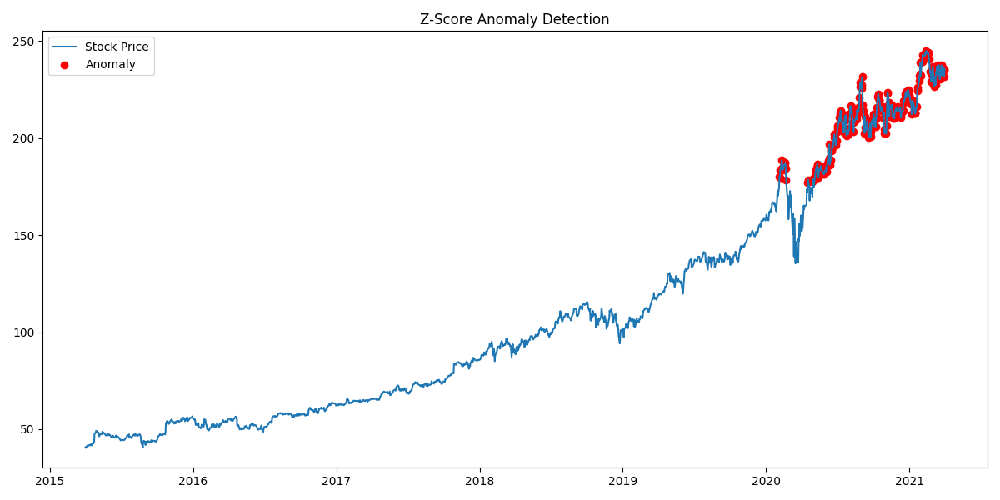
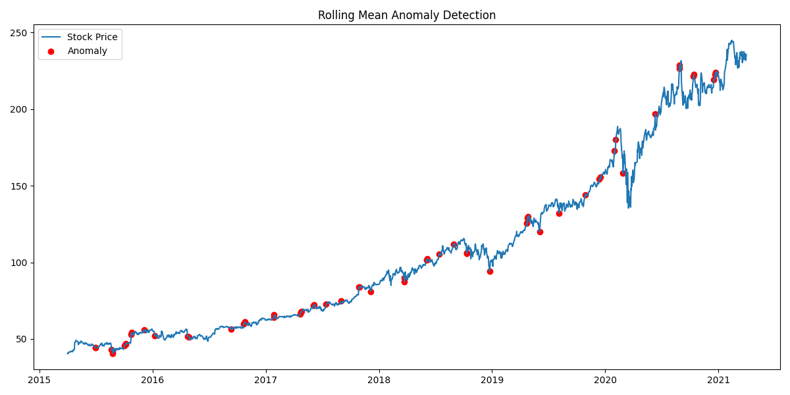
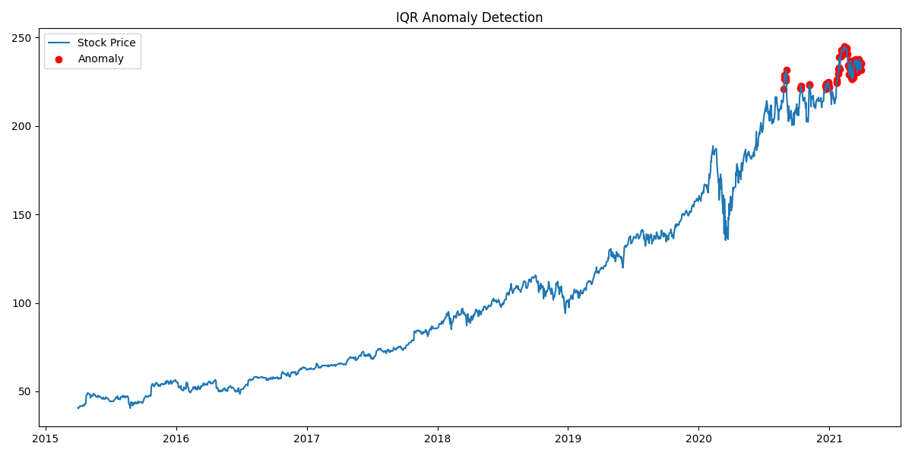
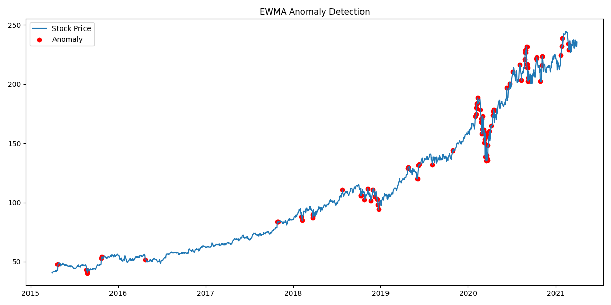
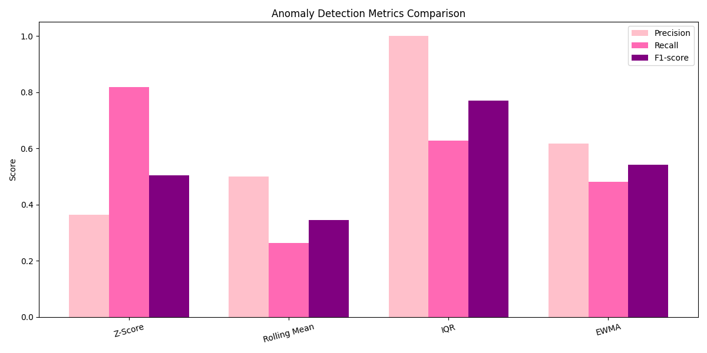
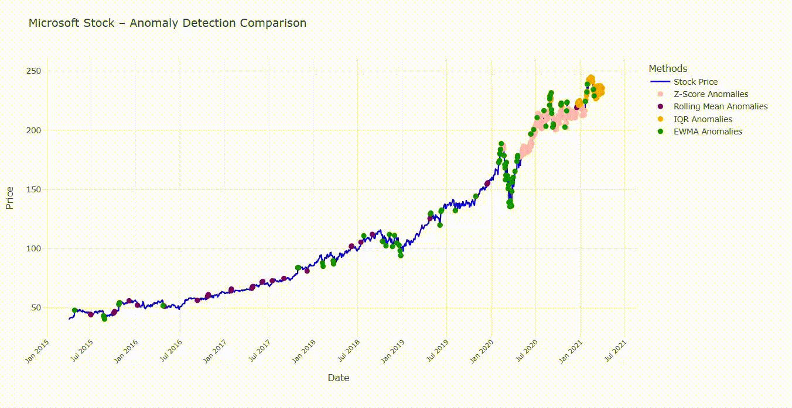

# Microsoft Stock Price Anomaly Detection

This project focuses on detecting anomalies in Microsoft stock price time series data using multiple statistical anomaly detection algorithms.  
The goal is to compare different methods and visualize their results.

---

## 📌 Project Overview

Anomaly detection in time series is a crucial task in domains such as finance, cybersecurity, and system monitoring.  
In this project, several widely used statistical techniques are applied to stock price data to identify unusual patterns and sudden deviations.

The project provides:
- Individual anomaly detection results per algorithm
- Comparative analysis between methods
- Evaluation metrics (Precision, Recall, F1-score)
- An interactive live visualization

---

## 📊 Dataset

The dataset consists of historical Microsoft (MSFT) stock price data.

- Source: [**Kaggle**](https://www.kaggle.com/datasets/vijayvvenkitesh/microsoft-stock-time-series-analysis)
- Used feature: **Closing Price**

The raw CSV data is stored under the `data/raw` directory and preprocessed before analysis.

---

### Example Outputs

- Z-Score  
  

- Rolling Mean  
  

- IQR  
  

- EWMA  
  

- Metrics Comparison Plot


- Interactive Anomaly Plot (Preview)



#### Interactive Anomaly Plot (LIVE)
🖱️: ̗̀➛
<a href="https://busracevik.github.io/numpy-microsoft-stock-anomaly-detection/index.html" target="_blank">
Interactive Anomaly Plot (Live)
</a>

---

## 📁 Project Structure

```text
microsoft_stock_anomaly_detection/
│
├── data/
│ ├── raw/ # Original Kaggle dataset (CSV)
│ └── processed/ # Cleaned & transformed NumPy arrays
│
├── outputs/
│ ├── plots/ # PNG plots with highlighted anomalies
│ │ ├── z_score.png
│ │ ├── rolling_mean.png
│ │ ├── iqr.png
│ │ ├── ewma.png
│ │ └── metrics_comparison.png
│
├── src/
│ ├── data_preparation.py # Data cleaning and preprocessing
│ ├── utils.py # Helper functions (load, save, plot)
│ ├── zscore.py # Z-Score anomaly detection
│ ├── rolling_mean.py # Rolling mean & standard deviation method
│ ├── iqr.py # Interquartile Range (IQR) method
│ ├── ewma.py # Exponentially Weighted Moving Average
│ ├── metrics.py # Precision, Recall, F1-score computation
│ ├── metrics_plot.py # Metrics visualization
│ └── compare.py # Algorithm comparison utilities
│
├── docs/
│ ├── demo.gif 
│ └── index.html # Interactive dashboard (GitHub Pages)
│
├── main.py # Project entry point
└── README.md

```

## 🛠 Technologies Used

- **Python** – Core programming language
- **NumPy** – Numerical computations and time series processing
- **Pandas** – Data loading and preprocessing
- **Matplotlib** – Static visualization and PNG output generation
- **Plotly** – Interactive visualizations for live dashboard
- **GitHub Pages** – Hosting the interactive HTML visualization

---

## 🧠 Implemented Anomaly Detection Algorithms

### Z-Score
Detects anomalies based on how many standard deviations a data point is away from the mean.  
Simple and effective for normally distributed data.

**Mathematical Definition:**

$$
z_t = \frac{x_t - \mu}{\sigma}
$$

A data point is considered an anomaly if:

$$
|z_t| > \tau
$$

where:  
- $\mu$ is the mean  
- $\sigma$ is the standard deviation  
- $\tau$ is the anomaly threshold  

---

### Rolling Mean & Standard Deviation
Uses a sliding window to compute local statistics.  
Useful for detecting contextual anomalies in time-dependent data.

**Mathematical Definition:**

$$
\mu_t = \frac{1}{w} \sum_{i=t-w}^{t} x_i
$$

$$
\sigma_t = \sqrt{\frac{1}{w} \sum_{i=t-w}^{t} (x_i - \mu_t)^2}
$$

An anomaly is detected if:

$$
|x_t - \mu_t| > k \cdot \sigma_t
$$

where:  
- $w$ is the window size  
- $k$ is a sensitivity parameter  

---

### Interquartile Range (IQR)
Identifies anomalies based on the spread between the first and third quartiles.  
Robust against outliers and non-normal distributions.

**Mathematical Definition:**

$$
IQR = Q_3 - Q_1
$$

Lower and upper bounds are defined as:

$$
LB = Q_1 - 1.5 \cdot IQR
$$

$$
UB = Q_3 + 1.5 \cdot IQR
$$

A data point is considered an anomaly if:

$$
x_t < LB \quad \text{or} \quad x_t > UB
$$

---

### Exponentially Weighted Moving Average (EWMA)
Applies exponential weighting to recent observations.  
Effective for detecting gradual drifts and sudden changes.

**Mathematical Definition:**

$$
S_t = \alpha x_t + (1 - \alpha) S_{t-1}
$$

Control limits:

$$
UCL = \mu + L \cdot \sigma
$$

$$
LCL = \mu - L \cdot \sigma
$$

An anomaly is detected if:

$$
S_t > UCL \quad \text{or} \quad S_t < LCL
$$

where:  
- $\alpha \in (0,1)$ is the smoothing factor  
- $L$ controls sensitivity

---